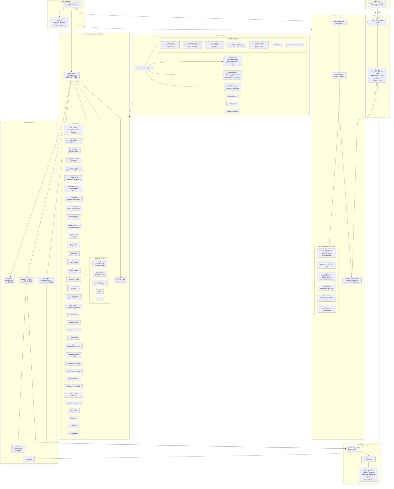
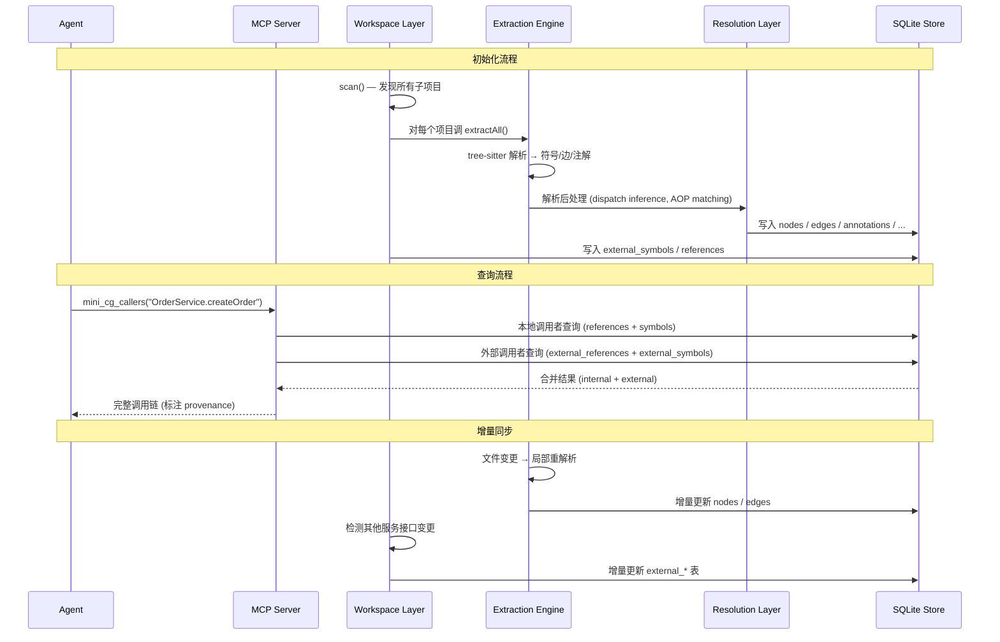

# Mini-CodeGraph 架构总览

## 整体架构图



## 核心数据流



## Spring Boot 企业项目数据流

```mermaid
graph LR
  subgraph FRONTEND["前端 (Vue/React/TS)"]
    AXIOS["axios.get('/api/orders')<br/>fetch('...')"]
    VUE_COMP["Vue SFC / React TSX<br/>Pinia Store / Vuex"]
  end

  subgraph GATEWAY["API Gateway"]
    GW_ROUTES["Spring Cloud Gateway<br/>/api/** → lb://order-service<br/>/user/** → lb://user-service"]
  end

  subgraph ORDER_SVC["Order Service (Spring Boot)"]
    CTRL["OrderController<br/>@RestController"]
    SVC["OrderService<br/>@Service"]
    REPO["OrderRepository<br/>JPA @Repository"]
    FEIGN["UserServiceClient<br/>@FeignClient"]
    MQ_PUB["OrderEventPublisher<br/>rabbitTemplate.convertAndSend"]
  end

  subgraph USER_SVC["User Service (Spring Boot)"]
    USER_CTRL["UserController<br/>@RestController"]
    USER_SVC["UserService<br/>@Service"]
    USER_REPO["UserRepository<br/>JPA @Repository"]
    USER_LISTENER["OrderEventListener<br/>@RabbitListener"]
  end

  subgraph MIDDLEWARE["中间件"]
    MYSQL[("MySQL<br/>orders / users")]
    MQ[("RabbitMQ<br/>order.exchange → order.queue")]
    REDIS[("Redis<br/>cache:orders")]
  end

  subgraph MINI_CG["mini-codegraph 分析结果"]
    DEP_GRAPH["跨服务依赖图<br/>Feign: order → user<br/>MQ: order → order_queue → user<br/>DB: order → MySQL<br/>Cache: order → Redis<br/>Frontend: Vue → Gateway → order"]
    DISPATCH["派发推断<br/>策略模式 / AOP / 反射<br/>条件注入 / 运行时选择"]
    IMPACT["影响分析<br/>修改 OrderService →<br/>哪些Controller / MQ / 前端受影响"]
  end

  AXIOS --> GW_ROUTES
  GW_ROUTES --> CTRL
  CTRL --> SVC
  SVC --> REPO
  SVC --> FEIGN
  SVC --> MQ_PUB
  FEIGN --> USER_CTRL
  USER_LISTENER --> MQ
  MQ_PUB --> MQ
  REPO --> MYSQL
  USER_REPO --> MYSQL
  SVC -.->|@Cacheable| REDIS

  MINI_CG --> DEP_GRAPH
  MINI_CG --> DISPATCH
  MINI_CG --> IMPACT
```

## 目录结构

```
src/
├── analysis/                    # 分析工具
├── cli/                         # CLI 入口 (commander)
├── core/                        # 内核 (codegraph 精简)
│   ├── indexer/                 # 索引调度
│   │   ├── full-index.ts        # 全量并行索引
│   │   ├── incremental.ts       # 增量更新
│   │   └── worker-pool.ts       # Worker 线程池
│   ├── parser/                  # tree-sitter 解析
│   │   └── languages/           # 各语言解析器
│   ├── store/                   # SQLite 存储 (v7 schema)
│   └── watcher/                 # 文件监视 (chokidar)
├── db/                          # 数据库访问层
│   ├── connection.ts            # SQLite 连接管理
│   ├── queries.ts               # 查询管理器
│   └── schema.ts                # 表定义 + SQL 语句
├── extraction/                  # 48+ 提取器
│   ├── languages/               # 语言解析器
│   ├── orchestrator.ts          # 提取编排 + 50+ 专业提取器
│   └── routes.ts                # 多框架路由检测
├── graph/                       # 图查询
│   ├── queries.ts               # 图查询管理器
│   └── traversal.ts             # 图遍历
├── mcp/                         # MCP 协议层
│   ├── handlers/                # 9 个 MCP 工具处理
│   ├── server.ts                # MCP Server
│   ├── tools.ts                 # 工具注册
│   └── transport.ts             # 传输层
├── resolution/                  # 解析推理层
│   ├── dispatch-inference/      # 派发推断引擎
│   │   ├── detectors/           # 7 个派发检测器
│   │   ├── variable-tracer.ts   # 跨方法变量追踪
│   │   ├── resolver.ts          # 合并 + 去重
│   │   └── types.ts             # 类型定义
│   ├── condition-matcher.ts     # @Conditional* 评估
│   ├── config-reader.ts         # 配置读取
│   └── frameworks/              # 框架检测
├── visualization/               # 可视化
│   └── mermaid.ts               # 6 种 Mermaid 图生成
├── workspace/                   # 工作区全局关系
│   ├── extractors/              # 7 个框架提取器
│   ├── graph-builder.ts         # provides/consumes 匹配
│   ├── scanner.ts               # 多项目发现
│   └── sync.ts                  # 工作区增量同步
├── ui/
└── shared/                      # 共享工具
```
